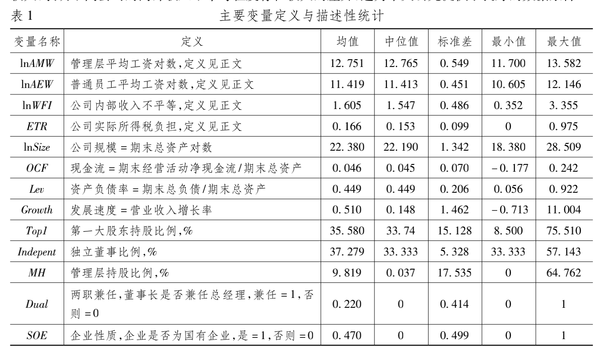

# Project Taxation-Interior [](https://awesome.re)

Tax incentives, rent sharing and income inequality within companies

<strong> Start Preprocessing_2010_data - 6/4/2022</strong>

<strong> Finish Proprocessiong_data - 7/4/2022 </strong>

<strong> Debug data - 8/4/2022 </strong>
**Participants**

- QUZIHAN WU

## Main Project

Please read <税收优惠、租金分享与公司内部收入不平等_张克中> first.

- Step 1: Preprocessing
   - proprocessng 2010-2019 data and get:
     - 
      <div align='center'>
      
      </div>

## Table of Content

- [Project Taxation-Interior ](#project-taxation-interior-)
  - [Main Project](#main-project)
  - [Table of Content](#table-of-content)
    - [Project Dependency](#project-dependency)
    - [Variables](#variables)
    - [Directories](#directories)
    - [Progress](#progress)
    - [LICENSE](#license)

### Project Dependency

```bash
# Please check requirements.txt for python module dependencies
cat requirements.txt

# Check python environment dependency via visit
cat spec-file.txt

# install the conda working environment via
conda create --name [ENV_NAME] --file spec-file.txt
```

### Variables

| Variable Name | Definition                                               |
| :-----------: | -------------------------------------------------------- |
|     InAMW     | 管理层平均[工资对数]('./img/工资对数解释.png')           |
|     InAEW     | 普通员工平均工资对数                                     |
|     InWFI     | 公司内部收入不平等                                       |
|      ETR      | [公司实际所得税负担]('./img/公司实际所得税负担解释.png') |
|    InSize     | 公司规模 = 期末总资产对数                                |
|      OCF      | 现金流 = 期末经营活动净现金流/期末总资产                 |
|      Lev      | 资产负债率 = 期末总负荷/期末总资产                       |
|    Growth     | 发展速度 = 营业收入增长率                                |
|     Topl      | 第一大股东持股比例， %                                   |
|   Indepent    | 独立董事比例， %                                         |
|      MH       | 管理层持股比例， %                                       |
|     Dual      | 两职兼任，董事长是否兼任总经理，兼任 = 1， 否 = 0        |
|      SOE      | 企业性质，企业是否为国有企业，是 = 1， 否 = 0            |

### Directories

### Progress

### LICENSE
